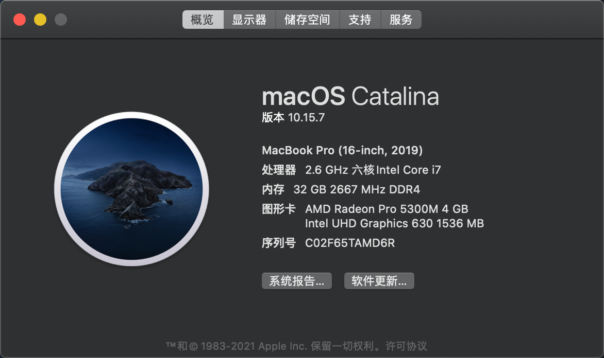
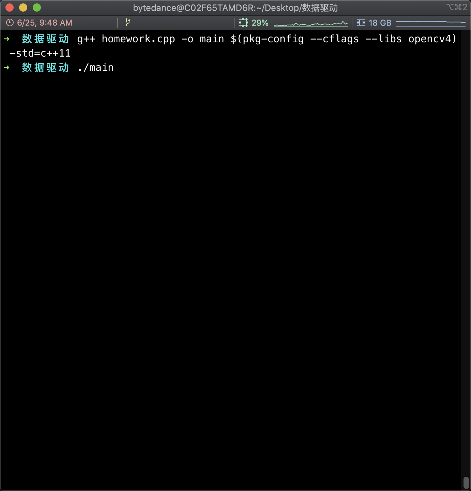
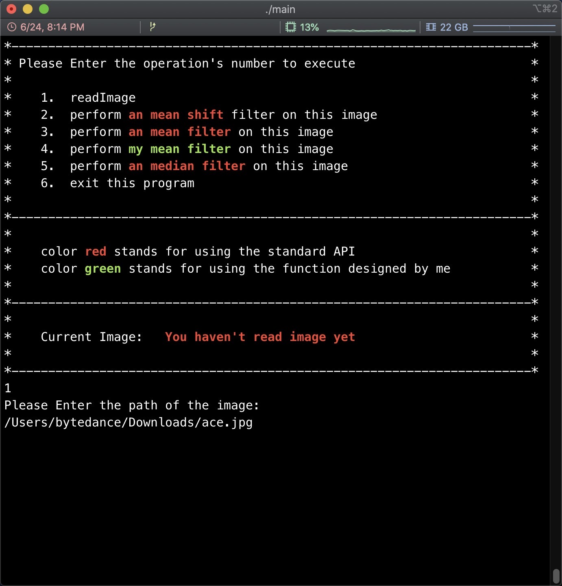
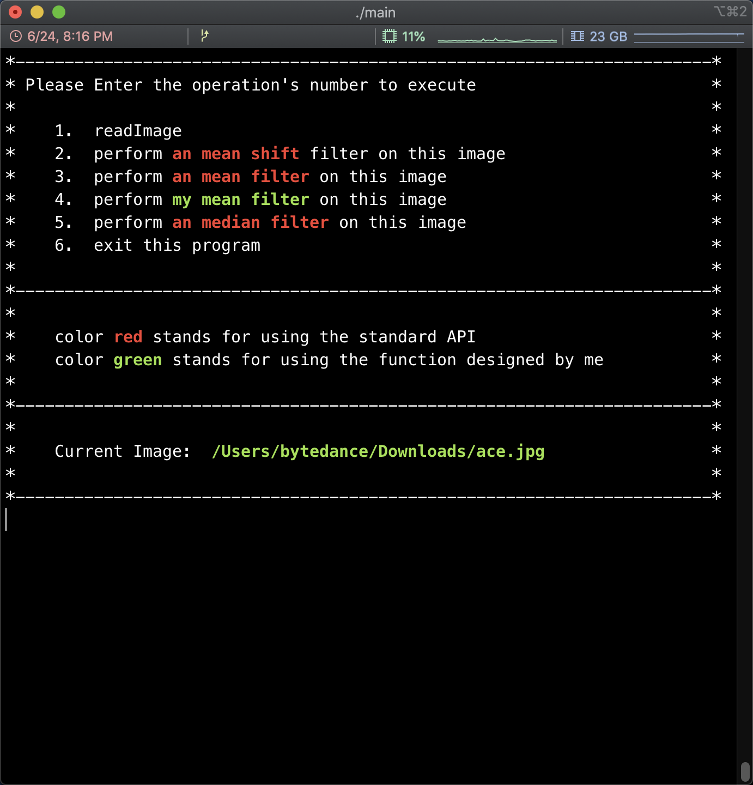
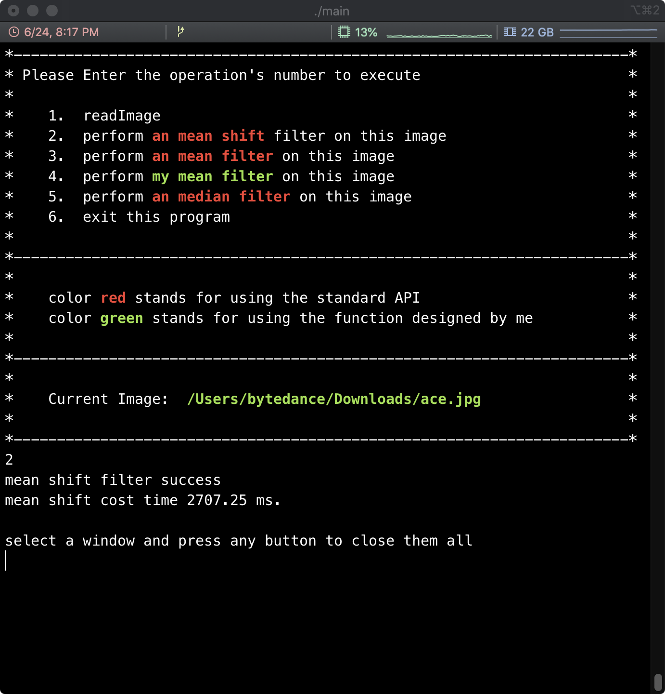
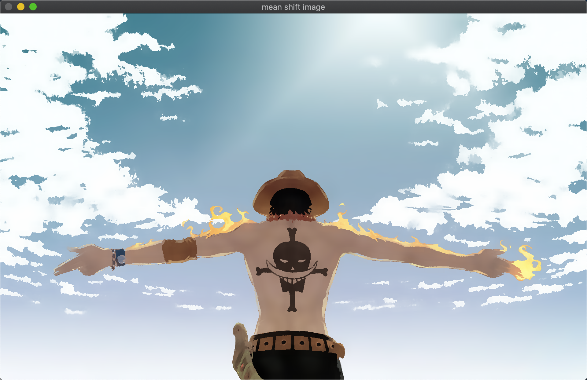
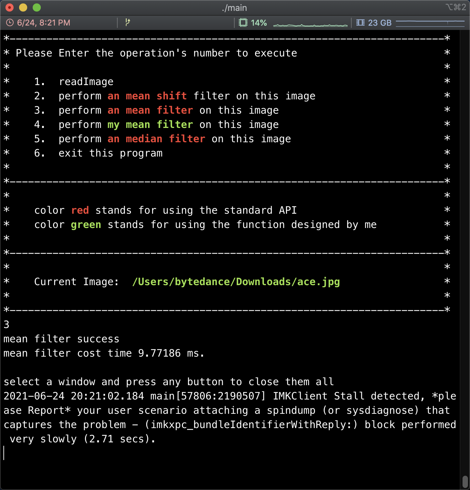
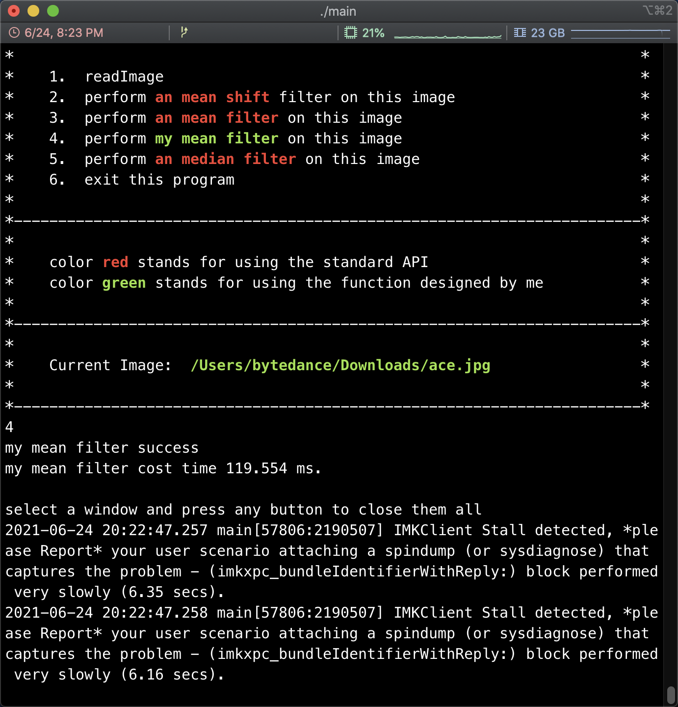
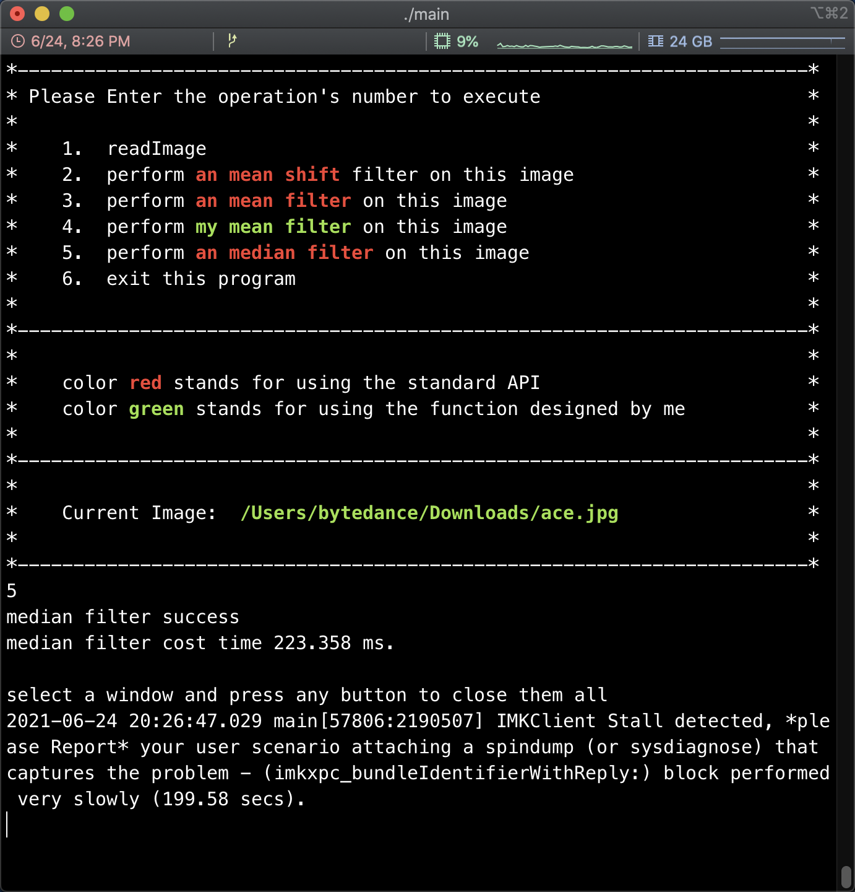

<center><h3> 数据驱动的可视化媒体处理 </h3></center>

<center><h3>17326032  林文锋  18级软件工程</h3></center>

### 程序功能

- [x] 经典均值滤波
- [x] 均值滤波的快速方法
- [x] 均值迁移滤波
- [x] 中值滤波


### 程序关键代码


> myMeanFilter通过调用优化的获取积分图方法来计算均值，首先判断输入的通道数并转换成灰度图（非灰度图其实等同于三个不同灰度图的均值滤波），然后遍历图片的每个元素进行均值计算即可。

```c++
void myMeanFilter(Mat& originSrc, Mat& dst, Size wsize){
    Mat src;
    if (originSrc.channels() > 1)
            cvtColor(originSrc, src, COLOR_RGB2GRAY);
    else src = originSrc;

    //图像边界扩充
    if (wsize.height % 2 == 0 || wsize.width % 2 == 0){
        fprintf(stderr, "window size must be odd");
        exit(-1);
    }
    int height = (wsize.height - 1) / 2;
    int width = (wsize.width - 1) / 2;
    Mat newSrc;

    // 官方API，生成边界以防止获取积分图时越界
    copyMakeBorder(src, newSrc, height, height, width, width, BORDER_REFLECT_101);//以边缘为轴，对称
    dst = Mat::zeros(src.size(), src.type());
    
    // 计算积分图
    Mat integralMat;
    Integral(newSrc, integralMat);
 
    // 利用积分图计算均值滤波
    double mean = 0;
    for (int i = height+1; i < src.rows + height + 1;++i){  //积分图图像比原图（边界扩充后的）多一行和一列 
        for (int j = width+1; j < src.cols + width + 1; ++j){
            int top = i - height - 1, left = j - width -1,
                bottom = i + height, right = j + width;
            double top_left = integralMat.at<double>(top, left);
            double top_right = integralMat.at<double>(top, right);
            double buttom_left = integralMat.at<double>(bottom, left);
            double buttom_right = integralMat.at<double>(bottom, right);
            mean = (buttom_right - top_right - buttom_left + top_left) / wsize.area();
            
            mean = std::max(std::min(mean, 255.), 0.);
            dst.at<uchar>(top, left) = static_cast<uchar> (mean);
        }
    }
}
```


> 优化的获取积分图的方法，

```c++
// 优化后获取积分图方法
// 由普通积分图at(i, j)加上当前行的和即可
// 对于W*H图像：2*(W-1)*(H-1)次加减法
// 是比普通积分图更优的方法
void Integral(Mat& src, Mat& dst){
    int sum_r = 0;
    dst = Mat::zeros(src.rows + 1, src.cols + 1, CV_64F);
    int rows = dst.rows, cols = dst.cols;
    for (int i = 1; i < rows; ++i){  
        for (int j = 1, sum_r = 0; j < cols; ++j) {
            // 行累加，因为积分图相当于在原图上方加一行，左边加一列，所以积分图的(1,1)对应原图(0,0),(i,j)对应(i-1,j-1)
            sum_r = src.at<uchar>(i-1 , j-1) + sum_r; 
            dst.at<double>(i, j) = dst.at<double>(i-1, j) + sum_r;
        }
    }
}
```


> 原积分图方法

```c++
// 优化前获取积分图的方法
//对于W*H图像：3*(W-1)*(H-1)次加减法
void Im_integral(Mat& src, Mat& dst){
    dst = cv::Mat::zeros(src.rows + 1, src.cols + 1, CV_64F);
    int rows = dst.rows, cols = dst.cols;
    for (int i = 1; i < rows; ++i){
        for (int j = 1; j < cols; ++j){
            double top_left = dst.at<double>(i - 1, j - 1);
            double top_right = dst.at<double>(i - 1, j);
            double buttom_left = dst.at<double>(i, j - 1);
            int buttom_right = src.at<uchar>(i-1, j-1);
            dst.at<double>(i, j) = top_right + buttom_right + buttom_left  - top_left;
        }
    }
}
```


### 程序运行方式

程序编译操作系统：



> 在Mac系统依次运行以下命令：

```shell
// 根据安装的opencv版本来决定 --libs opencv 后的数字，比如我安装的是opencv4
g++ homework.cpp -o main $(pkg-config --cflags --libs opencv4) -std=c++11
./main
```





### 程序运行展示

|                       准备读取图片                        |                       读取图片完成                        |
| :-------------------------------------------------------: | :-------------------------------------------------------: |
|         |         |
|                     均值迁移滤波命令                      |                       均值迁移结果                        |
|      |      |
|                       均值滤波命令                        |                       均值滤波结果                        |
|      |      |
|                     快速均值滤波命令                      |                     快速均值滤波结果                      |
|  |  |
|                       中值滤波命令                        |                       中值滤波结果                        |
|      |      |


### 参考文献

- [github源码](https://github.com/kipr/opencv)
- [opencv源码使用示例](https://docs.opencv.org/3.4.1/d4/d86/group__imgproc__filter.html#ga8c45db9afe636703801b0b2e440fce37)
- [不同操作系统的cmd命令调用](https://www.zhihu.com/question/58377556?sort=created)
- [Mac opencv 环境配置](https://blog.csdn.net/weixin_44692101/article/details/109526008)